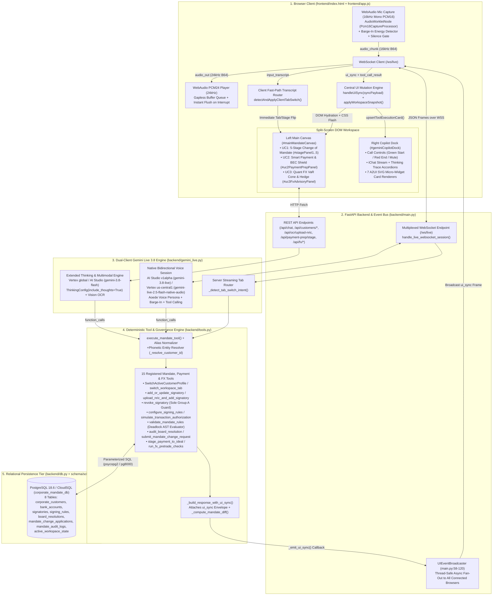
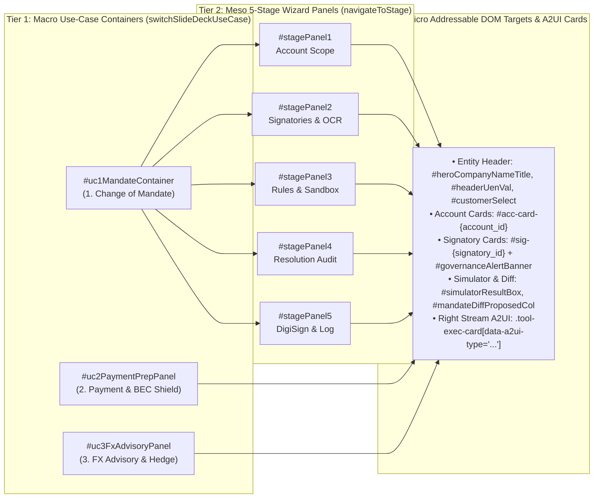
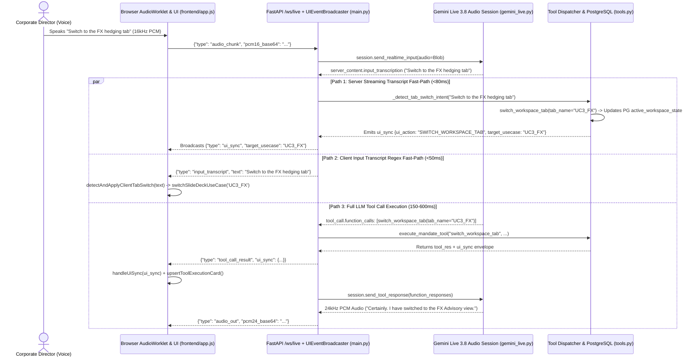
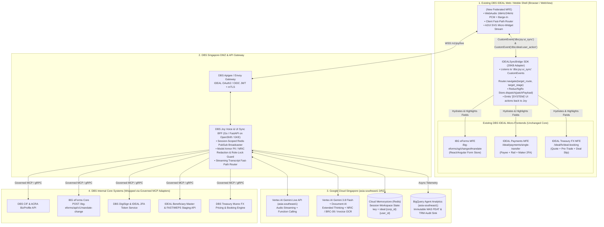

# Full Architecture & Voice-Driven UI Analysis of `ramneekkh/ui-demo` + Production POV for DBS IDEAL

## Executive Summary

This repository ([`ramneekkh/ui-demo`](https://github.com/ramneekkh/ui-demo) — **DBS IDEAL Corporate Mandate Hub — Gemini Live 3.8 Copilot**) is a production-grade, zero-mock reference implementation of a **Voice- and Chat-Driven Dynamic UI** for Corporate Banking. Built on **FastAPI**, **PostgreSQL 18.6 / CloudSQL**, **WebAudio PCM streaming**, and **Google Gemini Live (`models/gemini-3.8-live-extended-thinking` / `gemini-live-2.5-flash-native-audio` + `gemini-3.8-flash`)**, it demonstrates how a spoken utterance from a corporate director or treasurer can simultaneously:
1. Execute deterministic database mutations and compliance validations against PostgreSQL,
2. **Flip top-level application workspaces (`UC1_MANDATE`, `UC2_PAYMENT`, `UC3_FX`) and navigate multi-step wizard stages (`Stage 1..5`)**,
3. **Mutate and highlight live form controls, tables, and quantitative SVG charts on the main canvas**, and
4. **Inject self-contained A2UI micro-surface cards** directly into the conversational stream.

---

## Part 1: Full End-to-End Architecture of `ramneekkh/ui-demo`

### 1.1 System Topology & Data Flow Diagram



### 1.2 Core Architectural Layers in the Repository

| Layer | Files | Responsibility & Key Engineering Mechanics |
| :--- | :--- | :--- |
| **1. Relational State & Automatic Failover** | [`schema/schema.sql`](./schema/schema.sql), [`backend/db.py`](./backend/db.py), [`synthetic_data/seed.py`](./synthetic_data/seed.py) | Connects to CloudSQL PostgreSQL (`elevate-data-508005`) via ADC or auto-provisions a local user-space **PostgreSQL 18.6** instance (`127.0.0.1:5433`). Maintains 8 tables across 5 corporate entities (`CUST-001` to `CUST-005`), plus a singleton `active_workspace_state` table that tracks `active_customer_id`, `active_stage` (`1..5`), and `last_tool_executed`. |
| **2. Deterministic Tool & `ui_sync` Producer** | [`backend/tools.py`](./backend/tools.py) | Implements 15 database-backed tools (`MANDATE_TOOL_FUNCTIONS`). Every tool executes SQL inside a transaction, computes a real-time diff against baseline seed state (`_compute_mandate_diff`), builds a full `workspace_snapshot` (`_fetch_workspace_snapshot`), wraps the output in a standardized `ui_sync` payload (`_build_response_with_ui_sync`), and invokes `_emit_ui_sync(ui_sync)`. |
| **3. Dual-Client Gemini Live 3.8 Orchestrator** | [`backend/gemini_live.py`](./backend/gemini_live.py) | Combines **Live Native Audio** (`gemini-3.8-live` / `gemini-live-2.5-flash-native-audio` pinned to prebuilt voice `Aoede` with Singaporean corporate banker persona `JOY_VOICE_PERSONA`) for bidirectional 16kHz/24kHz PCM streaming, and **Extended Thinking** (`gemini-3.8-flash` with `ThinkingConfig(include_thoughts=True)`) for multi-step reasoning traces and multimodal NRIC Vision OCR. |
| **4. FastAPI Server & Thread-Safe Broadcaster** | [`backend/main.py`](./backend/main.py) | Hosts REST endpoints and `/ws/live`. Registers `UIEventBroadcaster.broadcast_sync` with `backend/tools.py` so even synchronous tool executions running on FastAPI worker threads (`asyncio.to_thread`) safely schedule WebSocket `ui_sync` broadcasts back onto the main ASGI event loop (`asyncio.run_coroutine_threadsafe`). |
| **5. Split-Screen Reactive Frontend & A2UI Engine** | [`frontend/index.html`](./frontend/index.html), [`frontend/app.js`](./frontend/app.js), [`frontend/styles.css`](./frontend/styles.css) | Vanilla JS + CSS single-page state machine (`window.__DBS_MANDATE_APP_LOADED__`) with zero framework overhead. Manages a 3-Use-Case macro switcher (`UC1_MANDATE`, `UC2_PAYMENT`, `UC3_FX`), a 5-stage mandate stepper (`Stage 1..5`), live SVG chart generators (USD/SGD Volatility Cone, Group Quorum Bars, Account Liquidity Bars), and a WebAudio PCM capture/playback engine. |

---

## Part 2: Detailed Analysis — How the UI is Constructed so Voice Can Flip and Mutate the UI on Commands

The defining capability of `ramneekkh/ui-demo` is that **voice is not a separate chat widget bolted onto a static page—voice is a first-class state-mutation controller for the entire DOM**. Below is the exact step-by-step breakdown of how the UI is architected to flip views, advance stages, populate forms, and trigger visual alerts from spoken commands.

### 2.1 The 3-Level Hierarchical DOM State Machine

In [`frontend/index.html`](./frontend/index.html) and [`frontend/app.js`](./frontend/app.js), the visual interface is structured as a **3-tier deterministic state machine** where every container, stage panel, card, and row has a predictable, addressable DOM ID:



1. **Tier 1 — Macro Use-Case Switcher (`switchSlideDeckUseCase(usecaseId)` in [`frontend/app.js:1473-1498`](./frontend/app.js#L1473-L1498))**:
   - Toggles `style.display` (`'block'` vs `'none'`) across `#uc1MandateContainer`, `#uc2PaymentPrepPanel`, and `#uc3FxAdvisoryPanel`, and updates the active pill styling on `.uc-tab-btn[data-usecase]`.
   - Automatically re-hydrates cached tool cards (`state.lastPaymentPrepCard`, `state.lastFxHedgeCard`) when flipping back to `UC2_PAYMENT` or `UC3_FX`.
2. **Tier 2 — Meso 5-Stage Stepper (`navigateToStage(stageNum, options)` in [`frontend/app.js:170-195`](./frontend/app.js#L170-L195))**:
   - Iterates `i = 1..5`, toggling `.active` and `.completed` classes on `#stepperBtn1..5` and `.active` on `<section class="stage-panel" id="stagePanel1..5">`.
   - When triggered with `{ flash: true }`, calls `flashElement('stagePanel' + target)`, which forces a CSS reflow (`void el.offsetWidth`) and triggers the `.flash-highlight` crimson/emerald pulse animation so the user's eye is immediately drawn to the newly flipped stage.
3. **Tier 3 — Micro Entity & Component Hydration (`applyWorkspaceSnapshot(snapshot)` in [`frontend/app.js:325-357`](./frontend/app.js#L325-L357))**:
   - Rather than mutating individual DOM nodes imperatively from scattered event handlers, **every backend mutation returns a complete, authoritative `workspace_snapshot` from PostgreSQL**.
   - `applyWorkspaceSnapshot(snapshot)` re-renders all 5 stages simultaneously in `<5ms` (`renderStage1EntityAndAccounts`, `renderStage2SignatoryMatrix`, `renderStage3SigningRules`, `renderStage4AuditAndMandateDiff`, `renderStage5ExecutionAndAuditLogs`) and then `handleUiSync` highlights the specific mutated element (`highlight_element: "sig-SIG-001-05"` or `"profile-CUST-004"`).

---

### 2.2 The 3-Path Voice-to-UI Flip Pipeline (Why UI Flips Feel Instantaneous)

When a user speaks into the microphone (e.g., *"Joy, switch to the FX tab"*, *"Switch to Veritas Legal and revoke Evelyn Tan"*, or *"Simulate a $250,000 USD payment"*), `ramneekkh/ui-demo` uses a **triple-layered routing pipeline** so the UI flips at the earliest possible millisecond:



#### Path 1: Client-Side Input Transcript Interceptor (`detectAndApplyClientTabSwitch` in [`frontend/app.js:1449-1471`](./frontend/app.js#L1449-L1471))
The moment Gemini Live streams back a user speech transcription (`case 'input_transcript'` at `app.js:1419`), the browser cleans any non-ASCII noise and passes the text to `detectAndApplyClientTabSwitch(asciiClean)`:
- It checks for an explicit navigation verb (`/\b(switch|go|open|navigate|move|return|back|show|take\s+me|view|change\s+tab|select\s+tab)\b/i`) paired with a target domain noun (`fx|foreign exchange|hedging`, `payment|bec|fraud shield`, or `mandate|signatories|stage [1-5]`).
- If matched, it **immediately invokes `switchSlideDeckUseCase(...)` and `navigateToStage(...)` on the client** before the LLM even finishes turn processing.

#### Path 2: Server-Side Streaming Transcript Interceptor (`_detect_tab_switch_intent` in [`backend/gemini_live.py:362-398`](./backend/gemini_live.py#L362-L398) & [`1112-1134`](./backend/gemini_live.py#L1112-L1134))
Simultaneously inside `_reader_loop()` in `backend/gemini_live.py`, as `sc.input_transcription` chunks arrive from the Gemini Live session:
- `_detect_tab_switch_intent(cleaned_in, active_cid)` runs via `asyncio.to_thread` (guarded so it never intercepts action verbs like `prepare`, `book`, `revoke`, `add`, `simulate`, `audit`, `submit`).
- When triggered, it executes `switch_workspace_tab()`, persists the new stage in PostgreSQL `active_workspace_state`, and broadcasts the `ui_sync` frame to all connected clients.

#### Path 3: The Canonical `ui_sync` Envelope Pattern (`_build_response_with_ui_sync` in [`backend/tools.py:350-388`](./backend/tools.py#L350-L388))
For all substantive banking commands (switching corporate profiles, adding/revoking signatories, configuring tiered rules, running transaction simulations, auditing board resolutions, staging payments, or booking FX forwards), Gemini Live emits a `tool_call` (`function_calls`).
Every tool in `backend/tools.py` concludes by calling `_build_response_with_ui_sync(...)`, which constructs and broadcasts a standardized **`ui_sync` command envelope**:

| Tool Executed (`backend/tools.py`) | `ui_action` Emitted | `target_usecase` | `target_stage` | `highlight_element` | Resulting UI Flip in `handleUiSync()` (`frontend/app.js:1717-1850`) |
| :--- | :--- | :--- | :--- | :--- | :--- |
| `SwitchActiveCustomerProfile` | `SWITCH_PROFILE` | `UC1_MANDATE` | `1` (or `target_stage`) | `profile-{cid}` | Switches top header dropdown (`#customerSelect`), re-hydrates all 5 stages for the new company, flashes entity header, renders **Corporate Liquidity Allocation SVG Card** in chat. |
| `update_target_accounts` | `UPDATE_TARGET_ACCOUNTS` | `UC1_MANDATE` | `1` | `stage1EntityCard` | Checks/unchecks `#acc-card-{id}` checkboxes, updates `X of Y` badge, updates Stage 4 Mandate Diff. |
| `add_or_update_signatory` / `upload_nric_and_add_signatory` | `REFRESH_SIGNATORY_MATRIX` | `UC1_MANDATE` | `2` | `sig-{sig_id}` | **Flips UI to Stage 2**, inserts/updates the signatory card in Group A/B/C column (`#groupAColumn`), flashes the new card, and renders the **NRIC OCR + Group Quorum Bar Chart** in chat. |
| `revoke_signatory` *(Success)* | `REVOKE_SIGNATORY` | `UC1_MANDATE` | `2` | `sig-{sig_id}` | **Flips UI to Stage 2**, marks card `.revoked` (`REVOKED` red badge), updates active group counts, adds to Stage 4 Revoked diff list. |
| `revoke_signatory` *(Sole Group A Blocked)* | `GOVERNANCE_BLOCK_SOLE_GROUP_A` | `UC1_MANDATE` | `2` | `governanceAlertBanner` | **Flips UI to Stage 2**, unhides & flashes `#governanceAlertBanner` (`GOVERNANCE_VIOLATION_SOLE_GROUP_A`), shows error toast, and renders red **Sole Group A Governance Shield** A2UI card. |
| `configure_signing_rules` | `CONFIGURE_RULES` | `UC1_MANDATE` | `3` | `signingRulesTable` | **Flips UI to Stage 3**, updates `#signingRulesTableBody` tier rows, and re-runs live transaction simulation. |
| `simulate_transaction_authorization` / `validate_mandate_rules` | `SIMULATE_AUTH` | `UC1_MANDATE` | `3` | `simulatorResultBox` | **Flips UI to Stage 3**, moves slider (`#simAmountSlider`), updates `#simulatorResultBox` with eligible signatory combinations or deadlock alerts, and renders **Mandate Threshold Waterfall SVG** in chat. |
| `audit_board_resolution` | `AUDIT_RESOLUTION` | `UC1_MANDATE` | `4` | `clauseChecklistGrid` | **Flips UI to Stage 4**, populates side-by-side Current vs. Proposed Mandate Diff (`#mandateDiffCurrentCol` / `#mandateDiffProposedCol`), updates 4 compliance checklist cards (`#clauseChecklistGrid`) and audit score badge (`100/100 COMPLIANT`). |
| `submit_mandate_change_request` / `execute_cosigner_signature` | `SUBMIT_MANDATE` / `EXECUTE_COSIGN` | `UC1_MANDATE` | `5` | `digisignTrackerList` | **Flips UI to Stage 5**, updates application badge (`COM-2026-...`), flips co-signer cards to `SIGNED` (`✓ Cryptographic Token Verified`), and prepends new rows to `#auditLogsTableBody`. |
| `stage_payment_to_ideal` | `STAGE_PAYMENT_TO_IDEAL` | `UC2_PAYMENT` | `1` | `uc2InvoiceCardContainer` | **Flips top-level tab to `UC2_PAYMENT`**, transitions standby banner to live extracted invoice (`INV-2026-889`), highlights 3-State Security Screening (`VERIFIED PAYEE` vs `BEC MISMATCH ALERT`), selects `FAST ($0)` vs `MEPS ($15)`, and updates button with `Ref FT262359902`. |
| `run_fx_pretrade_checks` / `book_fx_forward_contract` | `FX_HEDGE_EXECUTED` | `UC3_FX` | `1` | `uc3TradeConfirmationCard` | **Flips top-level tab to `UC3_FX`**, computes & plots dynamic **USD/SGD 90-Day Volatility Cone SVG** (`buildFxVolatilityConeSvg`), populates hedge sizing (`0.70 × USD 5M = USD 3.5M`), and marks Contract `CF03943335-01` `Booked ✓`. |

---

### 2.3 Inline A2UI Micro-Surface Cards & Bidirectional Stage-Jump Binding

Beyond mutating the left-hand workspace canvas, `frontend/app.js` implements an **A2UI (Agent-to-UI) Micro-Widget Engine** (`renderA2UIWidgetHtml` and `upsertToolExecutionCard` at [`frontend/app.js:2207-2559`](./frontend/app.js#L2207-L2559)):
- **Dual-Surface Presentation**: Because Joy's system prompt (`build_system_instruction` at `backend/gemini_live.py:357-358`) instructs her to keep spoken and text replies to *1–2 concise sentences*, `formatRichChatText()` (`app.js:1852-1881`) strips any raw markdown tables or headers from text bubbles while `upsertToolExecutionCard()` renders a dedicated, data-bound visual card right below the message bubble.
- **Interactive Stage-Jump Pills**: Every `.tool-exec-card` includes a header button:
  ```html
  <button type="button" class="tool-stage-jump-btn" data-jump-stage="${targetStage}">
    ${statusText} • Step ${targetStage} →
  </button>
  ```
  Clicking any historical tool card in the chat stream calls `navigateToStage(targetStage, { flash: true })`, jumping the left canvas back to the exact stage associated with that tool turn.
- **Zero-Duplicate Card Upsertion**: `state.toolCardMap[callId]` updates existing cards in-place as a tool transitions from `tool_call_start` (`Executing...`) to `tool_call_result` (`Completed • Step N →`), and deduplicates consecutive `entity-liquidity-chart` cards so the stream remains clean.

---

### 2.4 Resilient Voice Engineering: Role Lock, Barge-In, Phonetic Resolution & Stale Context Guards

Four subtle engineering mechanisms in `ramneekkh/ui-demo` prevent the failure modes that typically break voice-driven banking UIs:

1. **Continuous 16kHz Stream with Echo-Gated Silence Substitution ([`frontend/app.js:2903-2952`](./frontend/app.js#L2903-L2952))**:
   - Dropping WebSocket frames during quiet intervals breaks Gemini Live's server-side Voice Activity Detection (VAD), causing user turns to hang open.
   - Instead, `Pcm16CaptureProcessor` streams a **continuous 16kHz PCM stream** at all times, substituting digital zero-bytes (`pcm16 = new Int16Array(input.length)`) whenever `suppressAudio` is true (during phone ringback, mic mute, or low-energy speaker bleed `< 0.020` while Joy is speaking).
2. **Sub-100ms Client + Server Barge-In ([`frontend/app.js:2882-2901`](./frontend/app.js#L2882-L2901) & [`backend/gemini_live.py:1265-1271`](./backend/gemini_live.py#L1265-L1271))**:
   - While Joy is speaking (`state.activePlaybackNodes.length > 0`), if the user speaks into the mic with energy `rawAvgAbs >= 0.032` (or `>= 0.020` for 2 consecutive frames), the browser immediately calls `triggerBargeInInterruption()`.
   - This stops and disconnects all scheduled WebAudio `AudioBufferSourceNode` instances (`clearAudioPlaybackQueueOnly(true)`), records `state.interruptedTurnIds.add(currentAudioTurnId)` to drop any in-flight packets, and sends `{"type": "barge_in"}` to `/ws/live` to set `interrupt_event` on the server.
3. **Phonetic STT Entity Resolution ([`backend/tools.py:53-105`](./backend/tools.py#L53-L105))**:
   - Speech-to-Text models frequently transcribe corporate names phonetically (e.g., transcribing *"Veritas"* as *"very task"* or *"TechNova"* as *"tech nova"*).
   - `_resolve_customer_id()` combines fast phonetic keyword matching (`"very task" -> CUST-004`, `"tech nova" -> CUST-001`, `"singaport" | "banyan" -> CUST-005`) with PostgreSQL `ILIKE` matching on `company_name`, `uen`, and `governance_policy`.
4. **Stale System-Prompt `customer_id` Override Guard ([`backend/tools.py:2659-2682`](./backend/tools.py#L2659-L2682))**:
   - When a long-lived Gemini Live audio session is initialized while `CUST-001` is active, `"CUST-001"` is baked into the initial `system_instruction`. If the user later switches to `CUST-004` via voice, the LLM might still pass `customer_id="CUST-001"` in subsequent tool arguments.
   - `execute_mandate_tool()` intercepts `passed_cid == "CUST-001"` on non-switch tools, queries `SELECT active_customer_id FROM active_workspace_state` in PostgreSQL, and overrides `call_args["customer_id"]` with the true active profile (`CUST-004`) so tools never mutate the wrong customer!

---

## Part 3: Point of View (POV) — How to Implement This Architecture in DBS Bank's Existing `DBS IDEAL` App

### 3.1 Strategic Thesis: "Brownfield Sidecar & Event-Bus Bridge" (Zero Rewrite of Core DBS IDEAL)

DBS Bank's existing **DBS IDEAL** web and mobile platforms (`/ibg-eforms/sg/changeofmandate`, Single Transfer Payments, and Treasury FX) consist of battle-tested micro-frontends (Angular/React), strict form validators, and regulated Maker-Checker Digital Token workflows. **Attempting to rewrite DBS IDEAL's existing screens into a monolithic AI app would introduce unacceptable regression and regulatory risk.**

Instead, DBS should adopt a **Brownfield Sidecar & Event-Bus Bridge Architecture** directly derived from `ramneekkh/ui-demo`:
1. **Package DBS Joy (`#geminiCopilotDock`) as a Federated Micro-Frontend (`<dbs-joy-copilot-drawer />`)** mounted in the global DBS IDEAL shell header.
2. **Promote `ui_sync` into an Enterprise Client Event Bus (`IDEALSyncBridge`)**: When Gemini Live executes a tool on the backend, the `ui_sync` envelope is delivered over the existing `/ws/live` WebSocket to `<dbs-joy-copilot-drawer />`, which translates `ui_sync` into **route transitions and reactive state patches** consumed by the existing DBS IDEAL micro-frontends.
3. **Preserve Native DBS IDEAL 2FA / DigiSign as the Sole Execution Gate**: The AI agent and Dynamic UI operate strictly in the **Cognitive Preparation, Pre-Vetting, Fraud Screening, and Staging tier**. Final transaction release remains 100% inside native DBS IDEAL Digital Token (2FA) and DBS DigiSign.

---

### 3.2 Target Production Architecture for DBS IDEAL × DBS Joy (`GCP asia-southeast1`)



---

### 3.3 Concrete Engineering Blueprint: 4 Changes to Take `ui-demo` into DBS IDEAL Production

#### 1. Upgrade DOM-ID Manipulation to the `IDEALSyncBridge` Micro-Frontend Adapter
In `ramneekkh/ui-demo`, `handleUiSync()` directly mutates DOM elements (`document.getElementById('stagePanel2')`, `applyWorkspaceSnapshot()`). In DBS IDEAL's multi-team micro-frontend architecture, teams own separate Angular/React bundles.
- **How to build it**: Create a lightweight `IDEALSyncBridge` TypeScript SDK (`@dbs/ideal-joy-sync-bridge`) loaded in the DBS IDEAL host shell:
  ```typescript
  // Dispatched by <dbs-joy-copilot-drawer /> whenever a WebSocket `ui_sync` frame arrives:
  export interface DBSUiSyncEnvelope {
    type: 'ui_sync';
    ui_action:
      | 'SWITCH_WORKSPACE_TAB'
      | 'HYDRATE_PROFILE'
      | 'REFRESH_SIGNATORY_MATRIX'
      | 'GOVERNANCE_BLOCK_SOLE_GROUP_A'
      | 'CONFIGURE_RULES'
      | 'SIMULATE_AUTH'
      | 'AUDIT_RESOLUTION'
      | 'SUBMIT_MANDATE'
      | 'STAGE_PAYMENT_TO_IDEAL'
      | 'FX_HEDGE_EXECUTED';
    target_route: '/ibg-eforms/sg/changeofmandate' | '/ideal/payments/single-transfer' | '/ideal/fx/deal-booking';
    target_stage?: 1 | 2 | 3 | 4 | 5;
    highlight_field_ids?: string[];
    form_patch: Record<string, unknown>; // Mapped directly into Redux / NgRx / React Hook Form
    toast_notification?: { severity: 'success' | 'warning' | 'error' | 'info'; title: string; message: string };
  }
  ```
- **Each existing DBS IDEAL micro-frontend registers a 20-line listener**:
  - When `target_route` differs from `window.location.pathname`, the DBS IDEAL shell router navigates seamlessly (`idealRouter.navigate(sync.target_route)`).
  - When `target_stage` is present on `/ibg-eforms/sg/changeofmandate`, the existing eForm stepper advances to `sync.target_stage` and calls `formStore.patchValues(sync.form_patch)`.
  - **Reverse Synchronization (`UI -> Voice`)**: When a corporate user manually edits a field or clicks a checkbox on the DBS IDEAL form, `IDEALSyncBridge` sends `{"type": "sync_context", "stage": currentStage, "form_delta": {...}}` over `/ws/live` (just like `init`/`sync_context` at [`backend/gemini_live.py:1245-1263`](./backend/gemini_live.py#L1245-L1263)), keeping Joy's system prompt 100% aware of manual clicks.

#### 2. Multi-Tenant Session Isolation (`active_workspace_state` $\rightarrow$ Redis + OIDC Claims)
In `ramneekkh/ui-demo`, [`schema/schema.sql:175-183`](./schema/schema.sql#L175-L183) uses a single-row table (`WHERE workspace_id = 'DEFAULT_WORKSPACE'`) and a global `UIEventBroadcaster` (`self.connections: set[WebSocket]`) so all browser tabs share the same demo state.
- **In DBS Production**:
  - Partition `UIEventBroadcaster` by authenticated session (`self.connections_by_session: dict[str, set[WebSocket]]` keyed by `(ideal_corp_id, ideal_user_id, session_id)` extracted from the DBS IDEAL OAuth2/OIDC JWT).
  - Store `active_workspace_state` in **Cloud Memorystore for Redis (`asia-southeast1`)** with a 30-minute TTL (`ideal:session:{session_id}:state`), and persist draft eForm mutations in `mandate_change_applications` (`status = 'IN_REVIEW_DRAFT'`).
  - Eliminate `SwitchActiveCustomerProfile` for standard single-entity corporate users (locking `customer_id` strictly to the JWT's `ideal_corp_id` / `uen` via `RpcSP`), while keeping `SwitchActiveCustomerProfile` enabled **specifically for Group Holding CFOs / Multi-Entity Corporate Secretaries** whose DBS IDEAL token carries multi-UEN entitlements!

#### 3. Map `ui-demo`'s 15 Python Tools to Governed DBS Core MCP Servers
Every tool in [`backend/tools.py`](./backend/tools.py) maps 1-to-1 to an existing DBS internal microservice wrapped behind a governed **Model Context Protocol (MCP)** adapter:

| `ui-demo` Tool (`backend/tools.py`) | Production DBS IDEAL Backend Target | Production Enhancement |
| :--- | :--- | :--- |
| `get_customer_mandate_details` / `get_ideal_entity_profile` | **DBS CIF + ACRA BizProfile Gateway** | Hydrate real-time operating accounts, UEN directors, and current mandate version using the user's IDEAL OAuth token. |
| `upload_nric_and_add_signatory` | **Vertex AI Vision / Document AI (`asia-southeast1`) + DBS KYC/Name Screening** | Tokenize NRIC (`S****521J`) via Cloud DLP before logging; store encrypted specimen image in CMEK GCS bucket for back-office signature verification. |
| `revoke_signatory` + `validate_mandate_rules` | **DBS Mandate Rule Engine** | Keep `ui-demo`'s deterministic boolean combinatorics evaluator (`validate_mandate_rules` at `tools.py:2427-2499`) and `GOVERNANCE_VIOLATION_SOLE_GROUP_A` guard—this directly eliminates the #1 cause of back-office eForm rejections in DBS IDEAL. |
| `audit_board_resolution` | **DBS BRC-09 PDF Generator + Clause Auditor** | Generate watermarked `BRC-09` PDF pre-filled with the exact account & signatory diff, or run deterministic 4-gate LLM clause verification on custom board minutes. |
| `submit_mandate_change_request` + `execute_cosigner_signature` | **IBG eForms (`POST /ibg-eforms/api/v1/mandate-change`) + DBS DigiSign** | Create official `COM-2026-...` application, trigger real push notification to existing Group A directors' **DBS IDEAL Mobile Digital Tokens**, and dispatch SMS OTP web links via **DBS DigiSign** to newly appointed non-IDEAL directors. |
| `stage_payment_to_ideal` | **DBS Beneficiary Master + Payment Staging API (`POST /ideal/api/v2/payments/stage`)** | Cross-check OCR-extracted `(Beneficiary Name, Account No)` against the company's live DBS IDEAL Whitelisted Payees to flag **BEC Invoice Tampering**, auto-select `FAST` ($\le\$200\text{k}$) vs `MEPS+`, and stage `Ref FT...` into the Native IDEAL Maker-Checker approval queue. |
| `run_fx_pretrade_checks` + `book_fx_forward_contract` | **DBS Treasury Murex Pricing & Deal Execution API** | Stream live executable Spot/Forward/SecureFX rates with a 15-second rate-lock timer, verify credit facility utilization in Murex, and execute two-phase commit booking (`CF...`) upon Maker confirmation. |

#### 4. Enforce Vertex AI Singapore Residency (`asia-southeast1`) & Eliminate Client API Keys
- In `ui-demo`, `gemini_live.py` supports both AI Studio API keys (`v1alpha`) and Vertex AI (`global` / `us-central1`).
- For **MAS TRM and Singapore Data Residency compliance**, configure `get_genai_clients()` in the DBS Voice BFF to connect **exclusively via Vertex AI Private Service Connect (PSC) in `asia-southeast1` (Singapore)** using Workload Identity Federation, with **Google Cloud Model Armor** inspecting all prompts, transcripts, and tool outputs in flight.

---

### 3.4 Recommended 3-Phase Rollout Roadmap for DBS IDEAL

| Phase | Scope & User Experience | Engineering Deliverables | Target KPI Impact |
| :--- | :--- | :--- | :--- |
| **Phase 1: Read-Only & Simulation Sidecar (Weeks 1–4)** | Embed `<dbs-joy-copilot-drawer />` in DBS IDEAL. Users can ask voice/chat questions about their current mandate, simulate who can sign a `$250k USD` payment (`simulate_transaction_authorization`), or quantify 90-day USD/SGD FX exposure (`run_fx_pretrade_checks` with `execute_booking=False`) with live A2UI charts. | Deploy FastAPI/Go Voice BFF on GKE/OpenShift (`asia-southeast1`), connect read-only CIF & Treasury market data MCP tools, enable client/server `ui_sync` tab switching. | **Zero core risk**; immediate reduction in RM call center inquiries on mandate rules and FX quotes. |
| **Phase 2: Split-Canvas Form Auto-Fill & Pre-Flight Vetting (Weeks 5–8)** | Enable `IDEALSyncBridge` on `/ibg-eforms/sg/changeofmandate` and `/ideal/payments/single-transfer`. Voice commands and NRIC/Invoice uploads auto-populate the legacy IDEAL form fields in real time, run `validate_mandate_rules` deadlock checks, and run `audit_board_resolution` / BEC payee screening. | Integrate `IDEALSyncBridge` event listener into IBG eForms & Payment MFEs; wire Document AI OCR & Beneficiary Master screening tools. | **>65% reduction** in Change of Mandate back-office rejection rates; **100% interception** of mismatched-account BEC supplier invoices. |
| **Phase 3: Full Voice-to-Staging & Async DigiSign Orchestration (Weeks 9–12)** | Enable end-to-end staging (`submit_mandate_change_request` $\rightarrow$ `COM-2026-...` and `stage_payment_to_ideal` $\rightarrow$ `FT...`) where Joy prepares the complete package and triggers the native **DBS IDEAL Digital Token 2FA** / **DBS DigiSign SMS** prompt on the director's mobile device for cryptographic release. | Wire write-staging MCP adapters to `/ibg-eforms/api/v1/mandate-change`, `/ideal/api/v2/payments/stage`, and Murex FX Deal Booking; stream full trajectory logs to **BigQuery Agent Analytics (`BQAA`)**. | **3x faster turnaround** on corporate mandate amendments (from days to minutes) and higher SME FX forward hedge conversion. |
